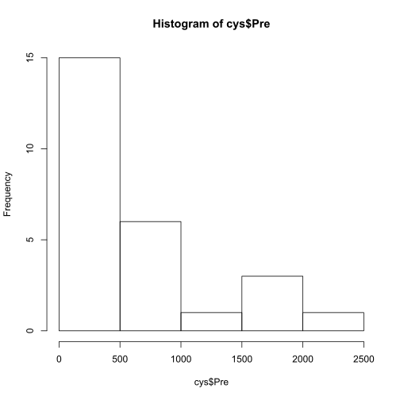

# KER Antioxidant Trial
### Description:  
Kentucky equine research project for sport and race Thoroughbred looking at 
different antioxidant concentrations including: GSH, Cysteine, Homo-Cysteine, 
Total AOP.  
  
***  
**Code:**  
Parent Directory:  

>&nbsp;&nbsp;&nbsp;&nbsp;/mnt/research/NMDL/KER_Antioxidant_Trial  
  
Directory/File:  
 
&nbsp;&nbsp;&nbsp;&nbsp;/KER_Antioxidant_Trial.R  
 
**Input files:**  
Directory/File:  
  
>&nbsp;&nbsp;&nbsp;&nbsp;/mnt/research/NMDL/Data_for_Stats_RER_Antioxidant_Normalized.txt  
  
**Output files:**  
  
Files:

>&nbsp;&nbsp;&nbsp;&nbsp;/KER_Antioxidant_Trial.Rdata    
 
Render R Script  
  
> &nbsp;&nbsp;&nbsp;&nbsp;KER_Antioxidant_Trial.qsub  

***  
### Code  
Load required libraries
Clear environment


```r
rm(list=ls())
```

 ### Summary Function


```r
summSD <- function(x, dig=4) round(c(summary(x),
     Std.Dev.=sd(x)), dig)[c("Min.", "1st Qu.", "Median", "Mean", 
    "Std.Dev.", "3rd Qu.", "Max.")]
```

Load data file for sport and race horses


```r
dir <- "/mnt/research/NMDL"
dataM <- read.table(paste(dir, "Data_for_Stats_RER_Antioxidant_Normalized.txt", sep="/"), 
    header=TRUE, sep="\t")
```

Move input file to R directory


```r
system("mv /mnt/research/NMDL/Data_for_Stats_RER_Antioxidant_Normalized.txt /mnt/research/NMDL/KER_Antioxidant_Trial")
```

Add GSH level factor to data matrix (cutoff 10)


```r
cutoff <- 10
dataM <- data.frame(dataM, GSH.level=rep("high", nrow(dataM)))
dataM$GSH.level <- as.character(dataM$GSH.level)
```

Index animals below GSH cutoff and assign GSH level (low or high)


```r
idx <- as.character(dataM$Animal[dataM$Assay == "GSH" & 
    dataM$Treatment == "Control" & dataM$Pre < cutoff]) 
dataM$GSH.level[as.character(dataM$Animal) %in% idx] <- "low"
dataM$GSH.level <- as.factor(dataM$GSH.level)
```

Check categories of low and high GSH:


```r
# All GSH Pre concentrations
summSD(dataM[dataM$Assay == "GSH", "Pre"])
```

```
##     Min.  1st Qu.   Median     Mean Std.Dev.  3rd Qu.     Max. 
##   3.3856   7.5159  10.6423  13.1042   8.8553  14.5667  41.6798
```

```r
# Low GSH in Control animals
summSD (dataM[dataM$GSH.level == "low" & dataM$Assay == "GSH" 
    & dataM$Treatment == "Control", "Pre"])
```

```
##     Min.  1st Qu.   Median     Mean Std.Dev.  3rd Qu.     Max. 
##   3.3856   5.5635   6.3307   6.2014   1.6257   7.0103   8.5457
```

```r
# High GSH in Control animals
summSD (dataM[dataM$GSH.level == "high" & dataM$Assay == "GSH" 
    & dataM$Treatment == "Control", "Pre"])
```

```
##     Min.  1st Qu.   Median     Mean Std.Dev.  3rd Qu.     Max. 
##  10.3798  11.4367  16.9457  18.3340   8.9737  20.8590  33.9690
```

### Run regression: ANOVA
> GSH


```r
# GSH Assay Data
gsh <- dataM[dataM$Assay == "GSH",]
nrow(gsh)
```

```
## [1] 26
```

```r
# Test Normality
shapiro.test(gsh$Pre)
```

```
## 
## 	Shapiro-Wilk normality test
## 
## data:  gsh$Pre
## W = 0.7975, p-value = 0.0001597
```

```r
hist(gsh$Pre)
```


```r
# Log transforme GSH pre values
gsh$Pre <- log(gsh$Pre)
shapiro.test(gsh$Pre)
```

```
## 
## 	Shapiro-Wilk normality test
## 
## data:  gsh$Pre
## W = 0.97833, p-value = 0.8367
```

```r
hist(gsh$Pre)
```


```r
# Treatment:Animal effect + GSH Level
gsh.rst <- aov(Pre~Animal + Treatment:GSH.level, data=gsh)
anova(gsh.rst)
```

```
## Analysis of Variance Table
## 
## Response: Pre
##                     Df Sum Sq Mean Sq F value  Pr(>F)  
## Animal              12 5.8529 0.48775  3.5118 0.02300 *
## Treatment:GSH.level  2 0.9331 0.46656  3.3592 0.07266 .
## Residuals           11 1.5278 0.13889                  
## ---
## Signif. codes:  0 '***' 0.001 '**' 0.01 '*' 0.05 '.' 0.1 ' ' 1
```

```r
TukeyHSD(gsh.rst)["Treatment:GSH.level"]
```

```
## $`Treatment:GSH.level`
##                                      diff        lwr       upr      p adj
## Treatment:high-Control:high  -0.004722811 -0.6522737 0.6428280 0.99999595
## Control:low-Control:high     -0.260520950 -0.8845166 0.3634747 0.60660079
## Treatment:low-Control:high    0.255798139 -0.3681975 0.8797938 0.61979021
## Control:low-Treatment:high   -0.255798139 -0.8797938 0.3681975 0.61979021
## Treatment:low-Treatment:high  0.260520950 -0.3634747 0.8845166 0.60660079
## Treatment:low-Control:low     0.516319089 -0.0831965 1.1158347 0.09918177
```

```r
# Type + Treatment:GSH Level
gsh2.rst <- aov(Pre~Type + Treatment:GSH.level, data=gsh)
anova(gsh2.rst)
```

```
## Analysis of Variance Table
## 
## Response: Pre
##                     Df Sum Sq Mean Sq F value    Pr(>F)    
## Type                 1 0.1986 0.19858  1.1917 0.2873502    
## Treatment:GSH.level  3 4.6160 1.53868  9.2341 0.0004298 ***
## Residuals           21 3.4992 0.16663                      
## ---
## Signif. codes:  0 '***' 0.001 '**' 0.01 '*' 0.05 '.' 0.1 ' ' 1
```

```r
TukeyHSD(gsh2.rst)
```

```
##   Tukey multiple comparisons of means
##     95% family-wise confidence level
## 
## Fit: aov(formula = Pre ~ Type + Treatment:GSH.level, data = gsh)
## 
## $Type
##                 diff        lwr       upr     p adj
## Sport-Race 0.1753051 -0.1586519 0.5092621 0.2873502
## 
## $`Treatment:GSH.level`
##                                      diff         lwr        upr     p adj
## Treatment:high-Control:high  -0.004722811 -0.66162900  0.6521834 0.9999970
## Control:low-Control:high     -1.013560375 -1.64657101 -0.3805497 0.0011407
## Treatment:low-Control:high   -0.497241286 -1.13025192  0.1357694 0.1587770
## Control:low-Treatment:high   -1.008837563 -1.64184820 -0.3758269 0.0011975
## Treatment:low-Treatment:high -0.492518474 -1.12552911  0.1404922 0.1647217
## Treatment:low-Control:low     0.516319089 -0.09185786  1.1244960 0.1149621
```

```r
# Treatment:GSH Level
gshM.rst <- aov(Pre~Treatment:GSH.level, data=gsh)
anova(gshM.rst)
```

```
## Analysis of Variance Table
## 
## Response: Pre
##                     Df Sum Sq Mean Sq F value    Pr(>F)    
## Treatment:GSH.level  3 4.7201 1.57337  9.6319 0.0002958 ***
## Residuals           22 3.5937 0.16335                      
## ---
## Signif. codes:  0 '***' 0.001 '**' 0.01 '*' 0.05 '.' 0.1 ' ' 1
```

```r
TukeyHSD(gshM.rst)
```

```
##   Tukey multiple comparisons of means
##     95% family-wise confidence level
## 
## Fit: aov(formula = Pre ~ Treatment:GSH.level, data = gsh)
## 
## $`Treatment:GSH.level`
##                                      diff         lwr        upr     p adj
## Treatment:high-Control:high  -0.004722811 -0.65268537  0.6432398 0.9999969
## Control:low-Control:high     -1.026082166 -1.65047452 -0.4016898 0.0008181
## Treatment:low-Control:high   -0.509763077 -1.13415543  0.1146293 0.1367051
## Control:low-Treatment:high   -1.021359355 -1.64575170 -0.3969670 0.0008603
## Treatment:low-Treatment:high -0.505040266 -1.12943262  0.1193521 0.1420663
## Treatment:low-Control:low     0.516319089 -0.08357768  1.1162159 0.1085850
```

> Cysteine
Cysteine Assay Data


```r
cys <- dataM[dataM$Assay == "Cysteine",]
nrow(cys)
```

```
## [1] 26
```

```r
# Test Normality
shapiro.test(cys$Pre)
```

```
## 
## 	Shapiro-Wilk normality test
## 
## data:  cys$Pre
## W = 0.78531, p-value = 0.0001001
```

```r
hist(cys$Pre)
```



```r
# Log transforme GSH pre values
cys$Pre <- log(cys$Pre)
shapiro.test(cys$Pre)
```

```
## 
## 	Shapiro-Wilk normality test
## 
## data:  cys$Pre
## W = 0.96801, p-value = 0.5725
```

```r
hist(cys$Pre)
```


```r
# Treatment:Animal effect + cys Level
cys.rst <- aov(Pre~Animal + Treatment:GSH.level, data=cys)
anova(cys.rst)
```

```
## Analysis of Variance Table
## 
## Response: Pre
##                     Df  Sum Sq Mean Sq F value Pr(>F)
## Animal              12 11.1049 0.92541  1.9560 0.1382
## Treatment:GSH.level  2  1.0695 0.53476  1.1303 0.3577
## Residuals           11  5.2042 0.47311
```

```r
TukeyHSD(cys.rst)["Treatment:GSH.level"]
```

```
## $`Treatment:GSH.level`
##                                     diff        lwr       upr     p adj
## Treatment:high-Control:high   0.36732153 -0.8278213 1.5624643 0.7924001
## Control:low-Control:high     -0.03424225 -1.1859107 1.1174262 0.9997266
## Treatment:low-Control:high    0.40156378 -0.7501046 1.5532322 0.7253697
## Control:low-Treatment:high   -0.40156378 -1.5532322 0.7501046 0.7253697
## Treatment:low-Treatment:high  0.03424225 -1.1174262 1.1859107 0.9997266
## Treatment:low-Control:low     0.43580602 -0.6706812 1.5422933 0.6477980
```

```r
# Type + Treatment:cys Level
cys2.rst <- aov(Pre~Type + Treatment:GSH.level, data=cys)
anova(cys2.rst)
```

```
## Analysis of Variance Table
## 
## Response: Pre
##                     Df  Sum Sq Mean Sq F value Pr(>F)
## Type                 1  1.1111 1.11113  1.8608 0.1870
## Treatment:GSH.level  3  3.7276 1.24253  2.0808 0.1333
## Residuals           21 12.5399 0.59714
```

```r
TukeyHSD(cys2.rst)
```

```
##   Tukey multiple comparisons of means
##     95% family-wise confidence level
## 
## Fit: aov(formula = Pre ~ Type + Treatment:GSH.level, data = cys)
## 
## $Type
##                 diff        lwr      upr     p adj
## Sport-Race 0.4146817 -0.2175142 1.046878 0.1869791
## 
## $`Treatment:GSH.level`
##                                    diff        lwr       upr     p adj
## Treatment:high-Control:high   0.3673215 -0.8762320 1.6108751 0.8427985
## Control:low-Control:high     -0.6739825 -1.8723007 0.5243357 0.4174716
## Treatment:low-Control:high   -0.2381765 -1.4364947 0.9601417 0.9444191
## Control:low-Treatment:high   -1.0413040 -2.2396222 0.1570142 0.1034573
## Treatment:low-Treatment:high -0.6054980 -1.8038162 0.5928202 0.5081792
## Treatment:low-Control:low     0.4358060 -0.7155009 1.5871129 0.7196576
```

```r
# Treatment:cys Level
cysM.rst <- aov(Pre~Treatment:GSH.level, data=cys)
anova(cysM.rst)
```

```
## Analysis of Variance Table
## 
## Response: Pre
##                     Df  Sum Sq Mean Sq F value Pr(>F)
## Treatment:GSH.level  3  3.9646 1.32152  2.1674 0.1207
## Residuals           22 13.4140 0.60973
```

```r
TukeyHSD(cysM.rst)
```

```
##   Tukey multiple comparisons of means
##     95% family-wise confidence level
## 
## Fit: aov(formula = Pre ~ Treatment:GSH.level, data = cys)
## 
## $`Treatment:GSH.level`
##                                    diff        lwr       upr     p adj
## Treatment:high-Control:high   0.3673215 -0.8845440 1.6191870 0.8468338
## Control:low-Control:high     -0.7036026 -1.9099304 0.5027251 0.3886794
## Treatment:low-Control:high   -0.2677966 -1.4741244 0.9385312 0.9257390
## Control:low-Treatment:high   -1.0709241 -2.2772519 0.1354036 0.0939291
## Treatment:low-Treatment:high -0.6351181 -1.8414459 0.5712096 0.4762173
## Treatment:low-Control:low     0.4358060 -0.7231962 1.5948083 0.7258582
```

> H-Cysteine
Homo.Cysteine Assay Data


```r
h.cys <- dataM[dataM$Assay == "Homo-Cysteine",]
nrow(h.cys)
```

```
## [1] 26
```

```r
# Test Normality
shapiro.test(h.cys$Pre)
```

```
## 
## 	Shapiro-Wilk normality test
## 
## data:  h.cys$Pre
## W = 0.87561, p-value = 0.004656
```

```r
hist(h.cys$Pre)
```


```r
# Log transforme GSH pre values
h.cys$Pre <- log(h.cys$Pre)
shapiro.test(h.cys$Pre)
```

```
## 
## 	Shapiro-Wilk normality test
## 
## data:  h.cys$Pre
## W = 0.97247, p-value = 0.6881
```

```r
hist(h.cys$Pre)
```


```r
# Treatment:Animal effect + h.cys Level
h.cys.rst <- aov(Pre~Animal + Treatment:GSH.level, data=h.cys)
anova(h.cys.rst)
```

```
## Analysis of Variance Table
## 
## Response: Pre
##                     Df Sum Sq Mean Sq F value Pr(>F)
## Animal              12 8.1777 0.68148  2.1607 0.1062
## Treatment:GSH.level  2 0.3549 0.17747  0.5627 0.5852
## Residuals           11 3.4693 0.31539
```

```r
TukeyHSD(h.cys.rst)["Treatment:GSH.level"]
```

```
## $`Treatment:GSH.level`
##                                     diff        lwr       upr     p adj
## Treatment:high-Control:high   0.29266541 -0.6831439 1.2684747 0.8038136
## Control:low-Control:high      0.06267435 -0.8776391 1.0029878 0.9969669
## Treatment:low-Control:high    0.22999106 -0.7103223 1.1703045 0.8805765
## Control:low-Treatment:high   -0.22999106 -1.1703045 0.7103223 0.8805765
## Treatment:low-Treatment:high -0.06267435 -1.0029878 0.8776391 0.9969669
## Treatment:low-Control:low     0.16731671 -0.7361072 1.0707406 0.9425769
```

```r
# Type + Treatment:h.cys Level
h.cys2.rst <- aov(Pre~Type + Treatment:GSH.level, data=h.cys)
anova(h.cys2.rst)
```

```
## Analysis of Variance Table
## 
## Response: Pre
##                     Df  Sum Sq Mean Sq F value Pr(>F)
## Type                 1  0.5529 0.55286  1.0867 0.3090
## Treatment:GSH.level  3  0.7657 0.25525  0.5017 0.6852
## Residuals           21 10.6834 0.50873
```

```r
TukeyHSD(h.cys2.rst)
```

```
##   Tukey multiple comparisons of means
##     95% family-wise confidence level
## 
## Fit: aov(formula = Pre ~ Type + Treatment:GSH.level, data = h.cys)
## 
## $Type
##                 diff        lwr       upr     p adj
## Sport-Race 0.2925088 -0.2910155 0.8760331 0.3090481
## 
## $`Treatment:GSH.level`
##                                     diff        lwr       upr     p adj
## Treatment:high-Control:high   0.29266541 -0.8551493 1.4404801 0.8917279
## Control:low-Control:high     -0.18882358 -1.2948855 0.9172383 0.9635893
## Treatment:low-Control:high   -0.02150687 -1.1275688 1.0845550 0.9999409
## Control:low-Treatment:high   -0.48148899 -1.5875509 0.6245729 0.6254806
## Treatment:low-Treatment:high -0.31417228 -1.4202342 0.7918896 0.8573803
## Treatment:low-Control:low     0.16731671 -0.8953532 1.2299866 0.9710304
```

```r
# Treatment:h.cys Level
h.cysM.rst <- aov(Pre~Treatment:GSH.level, data=h.cys)
anova(h.cysM.rst)
```

```
## Analysis of Variance Table
## 
## Response: Pre
##                     Df  Sum Sq Mean Sq F value Pr(>F)
## Treatment:GSH.level  3  0.8344 0.27812  0.5479 0.6548
## Residuals           22 11.1676 0.50762
```

```r
TukeyHSD(h.cysM.rst)
```

```
##   Tukey multiple comparisons of means
##     95% family-wise confidence level
## 
## Fit: aov(formula = Pre ~ Treatment:GSH.level, data = h.cys)
## 
## $`Treatment:GSH.level`
##                                     diff        lwr       upr     p adj
## Treatment:high-Control:high   0.29266541 -0.8495759 1.4349067 0.8914695
## Control:low-Control:high     -0.20971706 -1.3104083 0.8909742 0.9510924
## Treatment:low-Control:high   -0.04240035 -1.1430916 1.0582909 0.9995478
## Control:low-Treatment:high   -0.50238247 -1.6030737 0.5983088 0.5923461
## Treatment:low-Treatment:high -0.33506576 -1.4357570 0.7656255 0.8323038
## Treatment:low-Control:low     0.16731671 -0.8901932 1.2248267 0.9709716
```

### Run R Script


```r
htmlRunR
KER_Antioxidant_Trial.R nodes=1,cpus-per-task=1,time=03:00:00,mem=10G \
+KER Antioxidant Trial
```

